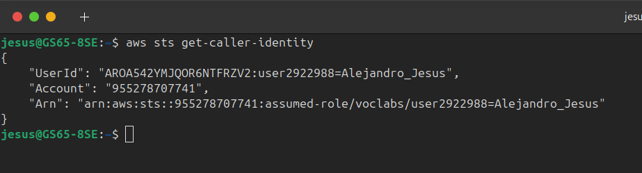
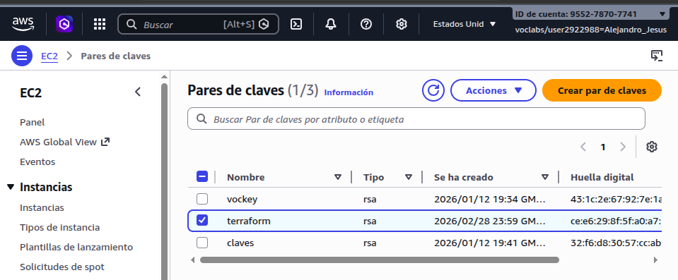
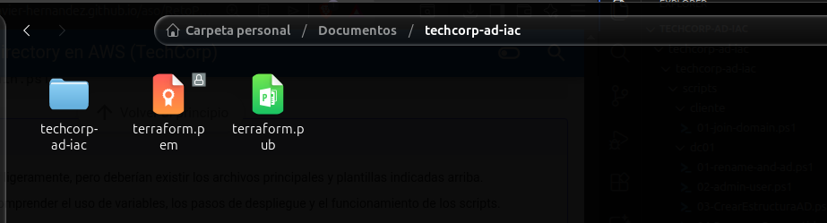
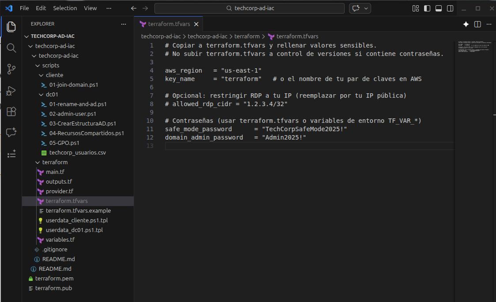
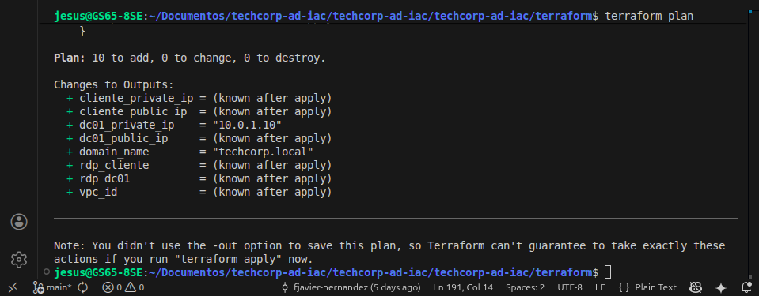
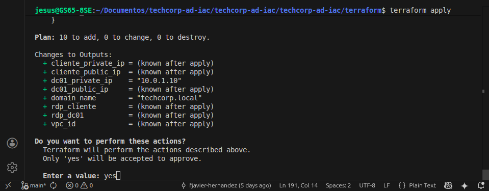
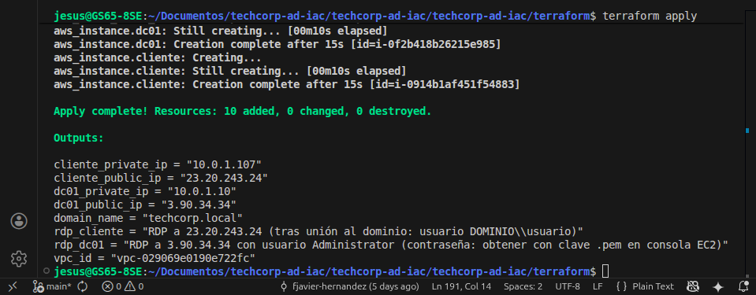
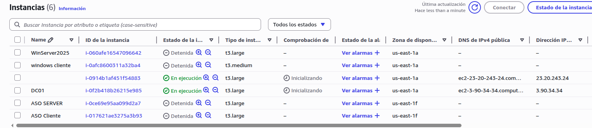

# 🚀 Reto Práctico: Despliegue Automatizado de Active Directory en AWS (TechCorp)

Este repositorio contiene la documentación y el código de Infraestructura como Código (IaC) para desplegar un entorno automatizado en Amazon Web Services (AWS) utilizando **Terraform**. 

El entorno despliega una red completa con un Controlador de Dominio (Windows Server 2022) y un Equipo Cliente, configurando Active Directory, OUs y usuarios mediante scripts de PowerShell inyectados a través del *User Data* de AWS.

---

## 🛠️ Fase 1: Preparación del Entorno y Credenciales

Antes de interactuar con Terraform, es indispensable verificar la conexión con AWS y preparar las claves de acceso para las instancias EC2.

### 1.1 Verificación de la sesión en AWS CLI
Se comprobó que la terminal de Ubuntu tenía acceso correcto a la cuenta de AWS Academy (`voclabs`) utilizando el comando de validación de identidad.

### 1.2 Creación del Par de Claves (Key Pair)
Para poder acceder a las máquinas Windows por RDP (y desencriptar la contraseña de Administrador), se generó un par de claves RSA en la consola de AWS nombrado como `terraform`.

Los archivos resultantes de la clave (`terraform.pem` y la clave pública) se descargaron y ubicaron en el directorio de trabajo local para tenerlos listos, asegurándonos de excluirlos del control de versiones para mantener la seguridad.

---

## ⚙️ Fase 2: Configuración de Variables (Terraform)

Para personalizar el despliegue sin modificar el código principal, se configuraron las variables del entorno. A partir del archivo de ejemplo, se creó el `terraform.tfvars` definitivo.

En este archivo se definió la región (`us-east-1`), el nombre de la clave creada en el paso anterior (`terraform`) y las contraseñas seguras para el Administrador del Dominio y el modo de recuperación (DSRM).

---

## 🚀 Fase 3: Planificación y Despliegue de la Infraestructura

Con el código saneado y las variables listas, procedimos a la creación de la infraestructura mediante los comandos principales de Terraform.

### 3.1 Planificación (Terraform Plan)
Se ejecutó el comando de planificación para validar la sintaxis y comprobar los recursos exactos que AWS iba a generar. El resultado indicó la creación limpia de **10 recursos** (VPC, Subred, IGW, Tablas de enrutamiento, Security Groups e instancias).

### 3.2 Confirmación del Despliegue (Terraform Apply)
Una vez verificado el plan, se aplicaron los cambios. Terraform solicitó la confirmación manual mediante la introducción del valor `yes` antes de interactuar con la API de AWS.

### 3.3 Finalización y Outputs
El proceso finalizó correctamente, mostrando el mensaje de éxito. Terraform devolvió por consola los *Outputs* preconfigurados, mostrando las IPs públicas y privadas del Controlador de Dominio (`DC01`) y del `cliente`, además del nombre del dominio configurado.

---

## 🖥️ Fase 4: Verificación en la Consola de AWS

Como paso final de la etapa de creación de infraestructura, se acudió a la consola web de AWS (panel de EC2) para verificar el estado real de las máquinas. 

Se confirmó que ambas instancias (`DC01` y `windows cliente`) estaban ubicadas en la región correcta, en estado **En ejecución (Running)** y pasando por la fase de **Inicialización** (momento en el que se están ejecutando los scripts de PowerShell del *User Data* para montar el Active Directory).

---

> **Nota de Seguridad:** Los archivos sensibles como `terraform.tfvars`, el estado de la infraestructura (`.tfstate`) y las claves `.pem` han sido excluidos explícitamente de este repositorio mediante `.gitignore` siguiendo las buenas prácticas de IaC.
